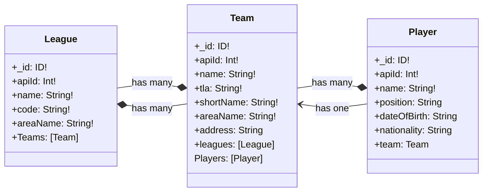

# Footleague API

This project exposes a GraphQL API allowing users to import and retrieve football leagues, teams, and player's data. It interacts with the [football-data.org](http://www.football-data.org/) API to fetch data, which is then stored in a MongoDB database.

## Technologies Used:
- **Node.js** for the server environment.
- **GraphQL** via the **Apollo Server** for defining and querying the data.
- **Mongoose** for MongoDB object modeling.
- **Express** as the web server framework.
- **Docker** for containerizing the application.

## Project Structure:
The project has a minimalistic design, which improves readability. Making it easier to navigate and understand. The project structure is as follows:
```
.
├── Dockerfile
├── docker-compose.yml
├── tsconfig.json
├── .env
├── package.json
└── src
    ├── server.ts
    ├── graphql
    │   ├── resolvers.ts
    │   └── schema.graphql
    ├── models
    │   ├── league.ts
    │   ├── player.ts
    │   └── team.ts
    └── services
        ├── databaseService.ts
        ├── importLeagueService.ts
        └── footballDataAPIService.ts
```

## Setup and Installation:

### Prerequisites:
- Docker and Docker Compose installed on your machine.
- An API key from [football-data.org](http://www.football-data.org/).

### How to Run:
1. Create a .env file and add:
  ```bash
  FOOTBALL_DATA_API_KEY={your-football-data-API-key}
  ```
2. Build the Docker images and start the containers using:
  ```bash
  docker-compose up --build
  ```
3. The GraphQL API and Playground will be accessible at `http://localhost:4050`

## GraphQL Schema:
The API defines the following main entities:
- **League**: Represents a football league.
- **Team**: Represents a football team associated with a league.
- **Player**: Represents a player or coach associated with a team.



## Queries and Mutations:
- **Queries**:
  - `team(name: String!)`: Fetches a team by its name.
  - `player(name: String!)`: Fetches a player by their name.
  - `players(leagueCode: String!, teamName: String)`: Fetches players based on a league code and optionally by team name.
  - `league(name: String!)`: Fetches a league by its name.
  - `allLeagues`: Fetches all leagues.
  - `allTeams`: Fetches all teams.
  - `allPlayers`: Fetches all players.
  
- **Mutations**:
  - `importLeague(leagueCode: String!)`: Imports league data based on the provided league code.

## Implementation Details:
- The `importLeague` mutation interacts with the external football-data.org API, fetches the data, and then stores it in the MongoDB database.
- Rate limiting is handled using `axios-rate-limit` to ensure adherence to the request frequency limits of the football-data.org API.
- The application is containerized using Docker, and the services (API and MongoDB) are orchestrated using Docker Compose.
